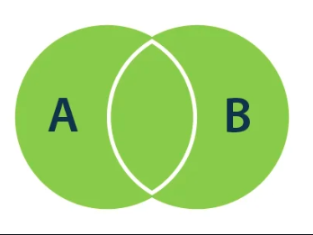

# SQLandMySQL
SQL and MySQL course of platzi


## Inner Join
Esta union retorna todas las filas de la tabla A que coinciden en la tabla B. Es decir aquellas que están en la tabla A Y en la tabla B, si lo vemos en conjuntos la intersección entre la tabla A y la B.


```
SELECT <columna_1> , <columna_2>,  <columna_3> ... <columna_n> 
FROM Tabla_A A
INNER JOIN Tabla_B B
ON A.pk = B.pk
```

## Left Join
Esta consulta retorna todas las filas que están en la tabla A y ademas si hay coincidencias de filas en la tabla B también va a traer esas filas.


```
SELECT <columna_1> , <columna_2>,  <columna_3> ... <columna_n> 
FROM Tabla_A A
LEFT JOIN Tabla_B B
ON A.pk = B.pk
```

## Right Join
Esta consulta retorna todas las filas de la tabla B y ademas si hay filas en la tabla A que coinciden también va a traer estas filas de la tabla A.


```
SELECT <columna_1> , <columna_2>,  <columna_3> ... <columna_n>
FROM Tabla_A A
RIGHT JOIN Tabla_B B
ON A.pk = B.pk
```

## Outer Join
Este join retorna TODAS las filas de las dos tablas. Hace la union entre las filas que coinciden entre la tabla A y la tabla B.



```
SELECT <columna_1> , <columna_2>,  <columna_3> ... <columna_n>
FROM Tabla_A A
FULL OUTER JOIN Tabla_B B
ON A.pk = B.pk
```

## Left excluding join
Esta consulta retorna todas las filas de la tabla de la izquierda, es decir la tabla A que no tienen ninguna coincidencia con la tabla de la derecha, es decir la tabla B.


```
SELECT <columna_1> , <columna_2>,  <columna_3> ... <columna_n>
FROM Tabla_A A
LEFT JOIN Tabla_B B
ON A.pk = B.pk
WHERE B.pk IS NULL
```

## Right Excluding join
Esta consulta retorna todas las filas de la tabla de la derecha, es decir la tabla B que no tienen coincidencias en la tabla de la izquierda, es decir la tabla A.


```
SELECT <columna_1> , <columna_2>,  <columna_3> ... <columna_n>
FROM Tabla_A A
RIGHT JOIN Tabla_B B
ON A.pk = B.pk
WHERE A.pk IS NULL
```

## Outer excluding join
Esta consulta retorna todas las filas de la tabla de la izquierda, tabla A, y todas las filas de la tabla de la derecha, tabla B que no coinciden.


```
SELECT <select_list>
FROM Table_A A
FULL OUTER JOIN Table_B B
ON A.Key = B.Key
WHERE A.Key IS NULL OR B.Key IS NULL
```